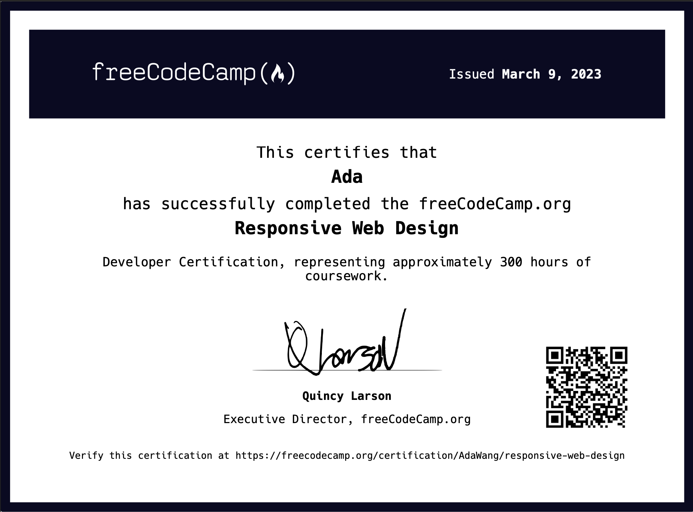

# Responsive-Web-Design-Certification
The course is divided into several sections, each of which contains a set of challenges and activities that build upon each other. I start by learning the basics of HTML and CSS, then move on to more advanced topics like responsive design, CSS grids, and CSS flexbox.

In order to earining this certification, I finished 5 projects. 

## Certification

## Projects
you can check all my code and projects by clicking [**here**](https://www.freecodecamp.org/certification/AdaWang/responsive-web-design)

- Build a Survey Form | [Requirements](https://www.freecodecamp.org/learn/2022/responsive-web-design/build-a-survey-form-project/build-a-survey-form)

- Build a Tribute Page | [Requirements](https://www.freecodecamp.org/learn/2022/responsive-web-design/build-a-tribute-page-project/build-a-tribute-page)

- Build a Technical Documentation Page | [Requirements](https://www.freecodecamp.org/learn/2022/responsive-web-design/build-a-technical-documentation-page-project/build-a-technical-documentation-page)

- Build a Product Landing Page | [Requirements](https://www.freecodecamp.org/learn/2022/responsive-web-design/build-a-product-landing-page-project/build-a-product-landing-page)

- Build a Personal Portfolio Webpage | [Requirements](https://www.freecodecamp.org/learn/2022/responsive-web-design/build-a-personal-portfolio-webpage-project/build-a-personal-portfolio-webpage)
